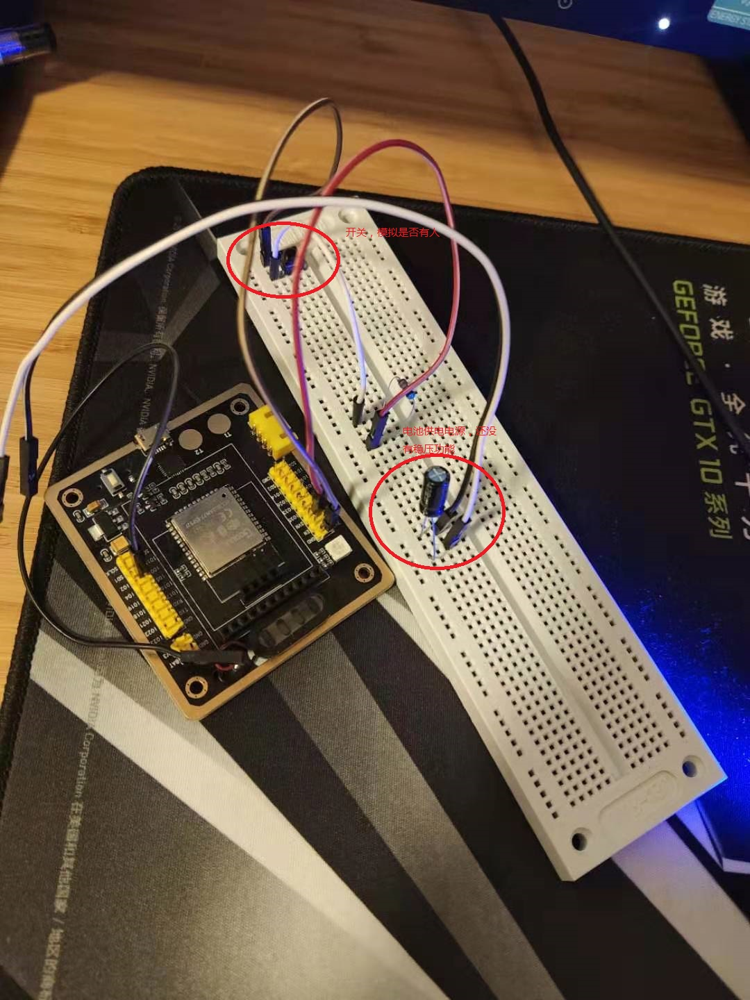

# Toilet Manager
## 需求
* 公司150人左右，大部分是男性，但男厕所只有2个马桶坑位，上大号经常没有坑位。
* 做个能在电脑上随时监控坑位的系统，以免同学们白跑路或者在门口排队。
* 如果需要，还可以搞个排队系统。
* 用户用浏览器查询是否有空位。

## 方案
### 硬件
* 
* 果云科技的Esp32f arduino开发板，使用的是乐鑫的esp32芯片
* 18650电池，稳压电源还不确定
### 传感器
* 马桶坑位的门锁，门锁有明确的是否有人两种状态，用一个开关可以获取状态，测试期间使用一个开关直接连接gpio来模拟。
* 人体传感器，未尝试

### 架构
* 自定义一台简单的web服务器S，对用户提供web访问服务。
* S服务器同时等待硬件报告厕所坑位状态。
* 用esp32f获得是否有人的状态，通过wifi联网，并报告状态到服务器S
* S与esp32f之间通过UDP通信

## 难点
* 传感器连接
* 稳压电源，目前测试了直接使用一节18650电池，最开始4v电压居然没有烧芯片。
* 功耗，wifi一直开启非常耗电，一节18650电池只能坚持3.5小时。
* 自定义简单的web服务器，需要简单了解http协议，并编码解析和响应。
* 如果后期有更复杂的web交互逻辑，可能需要考虑嵌入现成的enbeded web server。

## 当前进度
- [x] 搭建开发环境。
- [x] 实现硬件和软件通信。
- [x] 实现服务器S的自定义web功能。
- [x] 实现检测电路。
- [x] 实现和测试完整方案。
- [x] 用电池供电，测试功耗。
- [x] 低功耗，由于果云科技官方给的sdk是在乐鑫官方2017年的sdk上面改的，低功耗只有一个定时深度睡眠的功能，所以需要自己升级sdk，耽误了和多时间，2020.12.6终于升级成功。
- [ ] 稳压电源，我觉得还是应该有个稳压电源，以免烧坏芯片。
- [ ] 寻找便于实施的传感器方案。
- [ ] 上线测试。

## 开发日志
### 2020.12.6
* 通过实验，果云科技提供的开发文档中环境搭建也不如乐鑫官方的好，主要是sdk目录位置，直接放在开发工程项目里就行了，不需要放在arduino安装目录。
* 果云科技提供的老sdk是一个带有git信息的文件夹，所以比较方便查看他们在乐鑫的基础上的修改。
* 更新乐鑫官方sdk，然后把果云科技增加的variant/pins_arduino.h copy到相应位置。果云修改的boards.txt中的内容也copy到对应文件，同时修改esp-32f.upload.tool=esptool_py和esp-32f.build.boot=dio。
* 整理项目，上传到github。
* 学习了github的pr流程，打算把esp32f的修改推送给乐鑫官方。果云官方的示例程序在乐鑫的ci编译不过，放弃pr。
### 2020.12.12
* 查询到了并不是所有gpio都有下拉功能，目前查询到的只有io2和io12有
* 调整了触发引脚为io2和io12，睡眠功能ok。
### 2020.12.13
* 调整了代码，准备支持多个gpio，发现睡眠唤醒引脚同时好像只能一个，不能同时多个。
* 改为了一个引脚专门用来唤醒芯片，跟其他所有引脚并联。